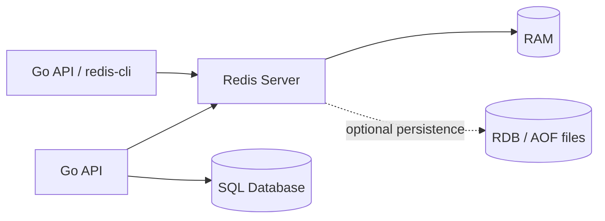

# Day 1: What Is Redis?

## Goal of the Day
Understand what Redis is, why backend systems use it, how to run it locally in this repo, and how to use basic Redis CLI commands safely.

By the end of today, you should be able to:

- Explain Redis in simple words.
- Start the local Redis container.
- Open `redis-cli` inside the container.
- Store, read, check, and delete simple keys.
- Understand where Redis fits beside a Go API and a SQL database.

## Why This Matters in Go Backend Work
Go backend services often need very fast access to temporary or frequently requested data. Redis is commonly used between the API and slower systems such as PostgreSQL, MySQL, third-party APIs, or background workers.

Typical Go backend use cases:

| Use Case | Redis Role | Example |
|---|---|---|
| Caching | Store frequently read responses | Cache user profile by `user:123` |
| Sessions | Store temporary login/session state | Session token expires after 24 hours |
| Counters | Atomic increments | Page views, login attempts |
| Queues | Lightweight background jobs | Send email later |
| Rate limiting | Protect endpoints | Limit login requests per IP |

Redis is not a replacement for your main database. In most production systems, Redis supports the application by making selected operations faster or more scalable.

## Core Concepts

### What Redis Is
Redis is an in-memory data store. It keeps data mainly in RAM, which makes reads and writes very fast compared with disk-based databases.

Redis can be used as:

- A cache.
- A temporary key-value store.
- A counter store.
- A lightweight queue.
- A coordination helper for backend systems.

### Redis vs SQL Database

| Topic | Redis | SQL Database |
|---|---|---|
| Main storage | Memory-first | Disk-first |
| Data model | Key-value and data structures | Tables, rows, relations |
| Query style | Command-based by key | SQL queries |
| Speed | Very fast for key access | Fast, but usually slower than Redis for simple key reads |
| Best for | Temporary, hot, simple-access data | Durable business data |
| Examples | Sessions, cache, counters | Users, orders, payments |

Use SQL for source-of-truth data. Use Redis for speed, temporary state, and simple atomic operations.

### Keys and Values
Redis stores data under keys.

Example:

```redis
SET name "redis"
GET name
```

Here:

- `name` is the key.
- `"redis"` is the value.

Key naming matters. In backend systems, prefer predictable names:

| Pattern | Meaning |
|---|---|
| `user:1` | User with ID 1 |
| `session:abc123` | Session token |
| `cache:user:1` | Cached user response |
| `login_attempts:ip:127.0.0.1` | Login attempt counter for one IP |

### In-Memory Architecture
Redis serves data from memory, so it is extremely fast. But memory is limited, so production Redis design must care about key count, value size, expiry, and eviction policies.



Redis can persist data to disk, but for now treat Redis as a fast supporting data store, not the main source of truth.

## Local Setup for This Repo
This repo already has Docker Compose configured with Redis `8.4.2`.

Start Redis:

```bash
docker compose up -d
```

Open Redis CLI:

```bash
docker exec -it redis-practice redis-cli
```

Run the existing practice file:

```bash
docker exec -i redis-practice redis-cli < practice.txt
```

Stop Redis:

```bash
docker compose down
```

## Command Table

| Command | Purpose | Example |
|---|---|---|
| `PING` | Check if Redis is responding | `PING` |
| `SET` | Store a string value | `SET name "redis"` |
| `GET` | Read a string value | `GET name` |
| `DEL` | Delete one or more keys | `DEL name` |
| `EXISTS` | Check whether a key exists | `EXISTS name` |
| `KEYS` | Find keys by pattern | `KEYS *` |
| `FLUSHDB` | Delete all keys in current DB | `FLUSHDB` |

Be careful with `KEYS *` and `FLUSHDB` in production. They are fine for local practice, but dangerous on real systems.

## CLI Practice
Open `redis-cli`, then run:

```redis
PING
SET name "redis"
GET name
EXISTS name
DEL name
GET name
EXISTS name
```

Expected ideas:

- `PING` returns `PONG`.
- `GET name` returns the saved value before deletion.
- After `DEL name`, `GET name` returns `(nil)`.
- After deletion, `EXISTS name` returns `0`.

Try key patterns:

```redis
SET user:1:name "Alice"
SET user:2:name "Bob"
KEYS user:*:name
```

## Production Notes

| Topic | Production Guidance |
|---|---|
| Key names | Use consistent prefixes such as `cache:`, `session:`, `counter:` |
| Value size | Keep values small and focused |
| Source of truth | Do not store critical business records only in Redis |
| Dangerous commands | Avoid `KEYS *` and `FLUSHDB` in production |
| Memory | Redis is memory-first, so memory usage must be monitored |
| Connection reuse | Go services should use connection pooling through the Redis client |

## Common Mistakes

| Mistake | Why It Is a Problem | Better Approach |
|---|---|---|
| Using Redis as the only database | Data durability and querying may not match business needs | Keep source-of-truth data in SQL |
| Creating random key names | Hard to debug and clean up | Use clear naming patterns |
| Running `KEYS *` in production | Can block Redis on large datasets | Use `SCAN` in real systems |
| Storing huge JSON blobs everywhere | Wastes memory and bandwidth | Cache only what is needed |
| Forgetting expiry for temporary data | Memory grows forever | Use TTL for temporary keys |

## Go-Focused Scenario
Imagine a Go API endpoint:

```text
GET /users/1
```

Without Redis:

```text
Client -> Go API -> SQL Database -> Go API -> Client
```

With Redis as cache:

```text
Client -> Go API -> Redis
                 -> if cache miss, SQL Database
                 -> save result in Redis
                 -> Client
```

Redis is useful when the same data is requested many times and does not need to be fetched from SQL every time.

Pseudo-flow:

```text
1. Build key: cache:user:1
2. Try GET cache:user:1 from Redis
3. If found, return cached response
4. If missing, query SQL
5. SET cache:user:1 with the response
6. Return response
```

You will study this more deeply on Day 4.

## Practice Tasks

### Task 1: Basic Key Operations
Run these commands:

```redis
SET language "go"
GET language
EXISTS language
DEL language
GET language
```

Confirm that the key disappears after deletion.

### Task 2: Backend-Style Key Names
Create three keys using backend-style names:

```redis
SET user:1:name "Alice"
SET user:1:role "admin"
SET cache:user:1 "cached user payload"
KEYS user:1:*
GET cache:user:1
```

Notice how prefixes make related data easier to find during local practice.

### Task 3: Use the Existing Practice File
From the repo root, run:

```bash
docker exec -i redis-practice redis-cli < practice.txt
```

Then open `redis-cli` and inspect the created keys:

```redis
KEYS *
GET name
GET counter
LRANGE tasks 0 -1
HGETALL user:1
TTL name
```

Some commands use data types you will study more later. For today, focus on seeing how Redis stores multiple kinds of data under keys.

### Task 4: Cleanup
Clean only your local practice database:

```redis
FLUSHDB
KEYS *
```

`KEYS *` should return an empty list.

## End-of-Day Checklist

- [ ] I can explain Redis as an in-memory data store.
- [ ] I can start Redis with `docker compose up -d`.
- [ ] I can open Redis CLI with `docker exec -it redis-practice redis-cli`.
- [ ] I can use `SET`, `GET`, `DEL`, and `EXISTS`.
- [ ] I understand that Redis usually supports a primary database instead of replacing it.
- [ ] I know why `KEYS *` and `FLUSHDB` are unsafe in production.
- [ ] I practiced with backend-style key names.

## Cheat Sheet / Summary

| Concept | Quick Reminder |
|---|---|
| Redis | Fast in-memory data store |
| Key | Name used to access data |
| Value | Data stored under a key |
| `SET` | Save a string value |
| `GET` | Read a string value |
| `DEL` | Delete a key |
| `EXISTS` | Check if key exists |
| Good Redis usage | Cache, sessions, counters, temporary data |
| Bad Redis usage | Only source of truth for important business records |

Day 1 is complete when you can confidently start Redis, open the CLI, and perform basic key-value operations without looking up every command.
