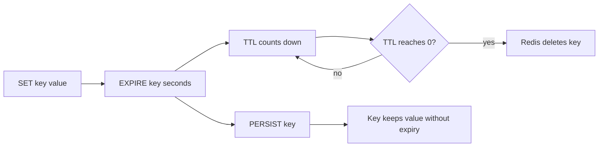

# Day 2: Expiry and TTL

## Goal of the Day
Learn how Redis automatically removes temporary data using expiry times, and practice the commands used to inspect and manage key lifetime.

By the end of today, you should be able to:

- Add an expiry to a key.
- Check how long a key has left to live.
- Remove an expiry from a key.
- Model simple OTP, session, and cache-expiration flows.
- Understand why TTL is important for memory safety.

## Why This Matters in Go Backend Work
Many Redis keys should not live forever. Go backend systems commonly use Redis for short-lived data such as login sessions, password reset tokens, OTPs, temporary cache entries, and rate-limit windows.

Examples:

| Backend Feature | Redis Key | Expiry Example |
|---|---|---|
| OTP verification | `otp:user:1` | 5 minutes |
| Login session | `session:token123` | 24 hours |
| Password reset | `password_reset:user:1` | 15 minutes |
| Cached user profile | `cache:user:1` | 10 minutes |
| Login attempt window | `login_attempts:ip:127.0.0.1` | 1 minute |

TTL prevents temporary data from staying in memory forever.

## Core Concepts

### Expiry
An expiry tells Redis to delete a key automatically after a specific amount of time.

Example:

```redis
SET otp:user:1 "123456"
EXPIRE otp:user:1 300
```

This key will disappear after 300 seconds.

### TTL
TTL means time to live. It tells you how many seconds a key has before Redis deletes it.

```redis
TTL otp:user:1
```

Common `TTL` results:

| Result | Meaning |
|---|---|
| Positive number | Seconds remaining |
| `-1` | Key exists but has no expiry |
| `-2` | Key does not exist |

### Setting Value and Expiry Together
For temporary values, it is often better to set the value and expiry in one command:

```redis
SET session:abc123 "user:1" EX 86400
```

This stores the value and sets expiry to 86400 seconds.

### Removing Expiry
`PERSIST` removes the expiry from a key, making it permanent until manually deleted or evicted.

```redis
PERSIST otp:user:1
```

Use this carefully. Most temporary keys should keep their expiry.

## TTL Lifecycle Diagram



## Command Table

| Command | Purpose | Example |
|---|---|---|
| `EXPIRE` | Set expiry in seconds | `EXPIRE name 60` |
| `TTL` | Check seconds remaining | `TTL name` |
| `PERSIST` | Remove expiry | `PERSIST name` |
| `SET ... EX` | Set value with expiry in seconds | `SET otp:user:1 "123456" EX 300` |
| `SET ... PX` | Set value with expiry in milliseconds | `SET lock:job "1" PX 5000` |
| `DEL` | Delete key manually | `DEL otp:user:1` |

## CLI Practice
Open Redis CLI:

```bash
docker exec -it redis-practice redis-cli
```

Practice basic expiry:

```redis
SET name "redis"
TTL name
EXPIRE name 60
TTL name
GET name
```

Wait a few seconds, then run:

```redis
TTL name
```

The number should decrease.

Practice a short-lived key:

```redis
SET short_key "temporary" EX 5
GET short_key
TTL short_key
```

Wait more than 5 seconds:

```redis
GET short_key
TTL short_key
```

Expected result:

- `GET short_key` returns `(nil)`.
- `TTL short_key` returns `-2`.

## Temporary Data Patterns

### OTP Pattern
An OTP should expire quickly.

```redis
SET otp:user:1 "123456" EX 300
TTL otp:user:1
GET otp:user:1
```

Pseudo-flow:

```text
1. User requests OTP
2. Go API generates code
3. Go API stores otp:user:1 with 5-minute TTL
4. User submits code
5. Go API reads Redis key
6. If code matches, verify user and delete the key
7. If key is missing, OTP expired
```

### Session Pattern
A session token should expire after a controlled period.

```redis
SET session:abc123 "user:1" EX 86400
TTL session:abc123
GET session:abc123
```

Pseudo-flow:

```text
1. User logs in
2. Go API creates session token
3. Redis stores session:abc123 -> user:1 with TTL
4. Each request sends token
5. Go API checks Redis
6. If missing, user must log in again
```

### Cache Expiration Pattern
Cached data should normally expire so stale data does not live forever.

```redis
SET cache:user:1 "cached profile response" EX 600
TTL cache:user:1
GET cache:user:1
```

Pseudo-flow:

```text
1. Request asks for user profile
2. Go API checks cache:user:1
3. If found, return cached response
4. If missing, query SQL
5. Store response in Redis with TTL
6. Return response
```

## Production Notes

| Topic | Production Guidance |
|---|---|
| Temporary keys | Always set TTL for sessions, OTPs, reset tokens, and caches |
| Atomic setup | Prefer `SET key value EX seconds` over separate `SET` then `EXPIRE` when possible |
| TTL length | Match TTL to business requirements, not random values |
| Stale cache | Shorter TTL means fresher data but more database reads |
| Memory safety | Expiry helps prevent unbounded memory growth |
| Security | Sensitive temporary keys should expire quickly and be deleted after use |

### Choosing TTL Values

| Data Type | Example TTL | Reason |
|---|---|---|
| OTP | 3-5 minutes | Short security window |
| Password reset token | 10-30 minutes | User needs time but token should not live long |
| Session | Hours or days | Depends on login policy |
| Cached profile | 5-30 minutes | Balance freshness and performance |
| Rate limit window | 1-60 seconds | Match endpoint protection rules |

## Common Mistakes

| Mistake | Why It Is a Problem | Better Approach |
|---|---|---|
| Forgetting TTL on temporary keys | Redis memory grows over time | Use `SET ... EX` for temporary data |
| Setting TTL too long | Data becomes stale or risky | Use business-driven expiry |
| Setting TTL too short | Users get poor experience | Match real workflow timing |
| Using separate `SET` then `EXPIRE` everywhere | App crash between commands can leave permanent key | Prefer `SET key value EX seconds` |
| Not deleting used OTPs | Same code may be reused before expiry | Delete OTP after successful verification |

## Go-Focused Scenario
Imagine a Go login flow using Redis sessions.

```text
POST /login
```

Pseudo-flow:

```text
1. Validate email and password against SQL database
2. Generate secure random session token
3. Store session:<token> -> user ID in Redis with TTL
4. Return token to client as cookie or response
```

For a protected endpoint:

```text
GET /me
```

Pseudo-flow:

```text
1. Read session token from request
2. Build Redis key: session:<token>
3. GET key from Redis
4. If missing, return 401 Unauthorized
5. If found, load or return user data
```

Redis TTL automatically logs the user out after the session expires.

## Practice Tasks

### Task 1: Understand TTL Return Values
Run:

```redis
SET day2:key "hello"
TTL day2:key
EXPIRE day2:key 30
TTL day2:key
DEL day2:key
TTL day2:key
```

Confirm these meanings:

- `-1` means the key exists without expiry.
- A positive number means seconds remaining.
- `-2` means the key does not exist.

### Task 2: Create an OTP Key
Run:

```redis
SET otp:user:42 "654321" EX 300
GET otp:user:42
TTL otp:user:42
```

Then simulate successful verification:

```redis
DEL otp:user:42
GET otp:user:42
```

### Task 3: Create a Session Key
Run:

```redis
SET session:test-token "user:42" EX 86400
GET session:test-token
TTL session:test-token
```

Think about what your Go middleware would do if `GET session:test-token` returns `(nil)`.

### Task 4: Practice `PERSIST`
Run:

```redis
SET cache:demo "value" EX 60
TTL cache:demo
PERSIST cache:demo
TTL cache:demo
DEL cache:demo
```

Confirm that after `PERSIST`, `TTL cache:demo` returns `-1`.

### Task 5: Extend Existing `practice.txt` Manually
The existing `practice.txt` already uses:

```redis
EXPIRE name 60
TTL name
```

Run the file:

```bash
docker exec -i redis-practice redis-cli < practice.txt
```

Then inspect:

```redis
GET name
TTL name
```

Wait a little and run `TTL name` again to see the countdown.

## End-of-Day Checklist

- [ ] I can explain what expiry means in Redis.
- [ ] I can use `EXPIRE` to add a TTL to an existing key.
- [ ] I can use `TTL` and understand `-1`, `-2`, and positive values.
- [ ] I can use `SET key value EX seconds` for temporary keys.
- [ ] I understand why OTPs and sessions need expiry.
- [ ] I know why cache entries usually need expiry.
- [ ] I understand why `SET ... EX` is safer than separate `SET` and `EXPIRE` for temporary data.

## Cheat Sheet / Summary

| Concept | Quick Reminder |
|---|---|
| Expiry | Automatic key deletion after time passes |
| TTL | Time to live; seconds remaining before deletion |
| `EXPIRE key seconds` | Add expiry to an existing key |
| `TTL key` | Check remaining lifetime |
| `PERSIST key` | Remove expiry from a key |
| `SET key value EX seconds` | Set value and expiry together |
| `TTL = -1` | Key exists without expiry |
| `TTL = -2` | Key does not exist |

Day 2 is complete when you can model OTP, session, and cache keys with correct expiry behavior.
