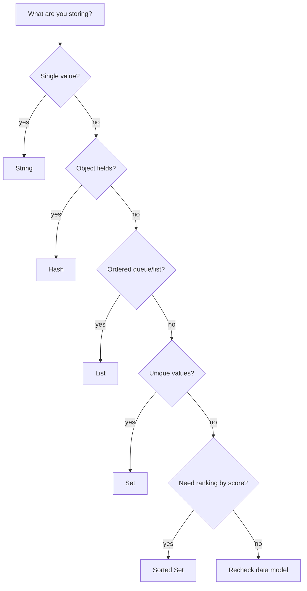

# Day 3: Redis Data Types

## Goal of the Day
Understand Redis core data types and learn when to use Strings, Hashes, Lists, Sets, and Sorted Sets in backend systems.

By the end of today, you should be able to:

- Choose the right Redis data type for common backend problems.
- Use basic commands for Strings, Hashes, Lists, Sets, and Sorted Sets.
- Understand simple anti-patterns that waste memory or make data hard to maintain.
- Connect Redis data types to Go API use cases.

## Why This Matters in Go Backend Work
Redis is more than a simple key-value store. The value stored under a Redis key can be a specific data structure. Picking the correct data type makes your backend simpler, faster, and safer.

Common Go backend examples:

| Backend Need | Good Redis Type | Example Key |
|---|---|---|
| Cache one response | String | `cache:user:1` |
| Store user fields | Hash | `user:1` |
| Store background jobs | List | `queue:emails` |
| Track unique visitors | Set | `visitors:article:10` |
| Leaderboard | Sorted Set | `leaderboard:weekly` |

The wrong type can lead to messy key naming, extra application code, or memory waste.

## Core Concepts

### String
A String is the simplest Redis value. It can store text, JSON, numbers, or small serialized payloads.

```redis
SET cache:user:1 "{name:Alice,role:admin}"
GET cache:user:1
```

Use Strings for:

- Cached API responses.
- Session values.
- OTP codes.
- Counters.
- Small serialized payloads.

### Hash
A Hash stores fields inside one Redis key. It is useful for object-like data.

```redis
HSET user:1 name "Alice" age "20" role "admin"
HGET user:1 name
HGETALL user:1
```

Use Hashes when you need to update or read individual fields without replacing the whole object.

### List
A List stores ordered values. You can push and pop from the left or right side.

```redis
LPUSH tasks "send email"
LPUSH tasks "resize image"
LRANGE tasks 0 -1
RPOP tasks
```

Use Lists for:

- Simple queues.
- Recent activity lists.
- Ordered logs for local/simple workflows.

### Set
A Set stores unique values without order.

```redis
SADD article:1:tags "redis" "go" "backend"
SADD article:1:tags "redis"
SMEMBERS article:1:tags
SISMEMBER article:1:tags "go"
```

Use Sets for:

- Unique visitors.
- Tags.
- Membership checks.
- Deduplication.

### Sorted Set
A Sorted Set stores unique values with a numeric score. Redis keeps the items sorted by score.

```redis
ZADD leaderboard 100 "alice"
ZADD leaderboard 250 "bob"
ZRANGE leaderboard 0 -1 WITHSCORES
ZREVRANGE leaderboard 0 2 WITHSCORES
```

Use Sorted Sets for:

- Leaderboards.
- Rankings.
- Top-N lists.
- Time-ordered items where score is a timestamp.

## Data Type Selection Diagram



## Command Table

| Type | Commands | Purpose |
|---|---|---|
| String | `SET`, `GET`, `INCR`, `DECR` | Simple values and counters |
| Hash | `HSET`, `HGET`, `HGETALL`, `HDEL` | Object-like fields |
| List | `LPUSH`, `RPUSH`, `LPOP`, `RPOP`, `LRANGE` | Ordered lists and simple queues |
| Set | `SADD`, `SREM`, `SMEMBERS`, `SISMEMBER` | Unique unordered values |
| Sorted Set | `ZADD`, `ZRANGE`, `ZREVRANGE`, `ZREM` | Unique values ordered by score |
| Generic | `TYPE`, `DEL`, `EXPIRE`, `TTL` | Inspect and manage keys |

## CLI Practice
Open Redis CLI:

```bash
docker exec -it redis-practice redis-cli
```

Start clean for practice:

```redis
FLUSHDB
```

Practice String:

```redis
SET cache:message "hello redis"
GET cache:message
TYPE cache:message
```

Practice Hash:

```redis
HSET user:1 name "Alice" age "20" role "admin"
HGET user:1 name
HGETALL user:1
TYPE user:1
```

Practice List:

```redis
LPUSH queue:emails "email-1"
LPUSH queue:emails "email-2"
RPUSH queue:emails "email-3"
LRANGE queue:emails 0 -1
RPOP queue:emails
LRANGE queue:emails 0 -1
```

Practice Set:

```redis
SADD tags:post:1 "redis" "go" "backend"
SADD tags:post:1 "redis"
SMEMBERS tags:post:1
SISMEMBER tags:post:1 "go"
```

Practice Sorted Set:

```redis
ZADD leaderboard:weekly 100 "alice"
ZADD leaderboard:weekly 250 "bob"
ZADD leaderboard:weekly 180 "charlie"
ZRANGE leaderboard:weekly 0 -1 WITHSCORES
ZREVRANGE leaderboard:weekly 0 2 WITHSCORES
```

## Data Type Use Case Table

| Problem | Best Type | Why |
|---|---|---|
| Store cached JSON response | String | Simple read/write by key |
| Store profile fields | Hash | Update fields independently |
| Process jobs in order | List | Push and pop from ends |
| Track unique active users | Set | Automatically prevents duplicates |
| Show top users by score | Sorted Set | Keeps ranking by numeric score |
| Count page views | String counter | `INCR` works on numeric strings |

## Production Notes

| Topic | Production Guidance |
|---|---|
| Type choice | Model by access pattern, not by habit |
| Large values | Avoid storing huge blobs unless necessary |
| Hashes | Good for field-level updates, but avoid giant unbounded hashes |
| Lists | Good for simple queues, but define retry and failure behavior |
| Sets | Good for uniqueness, but large sets still use memory |
| Sorted Sets | Scores should have clear meaning, such as points or timestamps |
| Expiry | Temporary keys should still use TTL, regardless of type |

## Memory Considerations
Redis is memory-first. Each data type has overhead. Good modeling keeps memory predictable.

| Pattern | Memory Risk | Safer Approach |
|---|---|---|
| Storing full API responses forever | Memory grows without bound | Add TTL to cache keys |
| One key per tiny field | Too many keys to manage | Use Hash for related fields |
| Huge Lists with no cleanup | Old items stay forever | Trim or consume items |
| Large Sets for analytics forever | High memory usage | Expire, aggregate, or move long-term data to SQL/analytics storage |
| Large Sorted Sets | Ranking data grows forever | Keep only needed time window or top N |

## Common Mistakes

| Mistake | Why It Is a Problem | Better Approach |
|---|---|---|
| Using String JSON for everything | Hard to update one field | Use Hash when field updates matter |
| Using many unrelated fields in one Hash | Hard to reason about ownership | Keep Hashes focused |
| Expecting Sets to keep order | Sets are unordered | Use List or Sorted Set if order matters |
| Using List for uniqueness | Lists allow duplicates | Use Set for unique values |
| Forgetting `TYPE` during debugging | Wrong commands fail with type errors | Check key type first |

## Go-Focused Scenario
Imagine a Go API for user data, article tags, and a weekly leaderboard.

```text
GET /users/1
GET /articles/10/tags
GET /leaderboard/weekly
```

Redis modeling:

| Endpoint | Redis Key | Type | Reason |
|---|---|---|---|
| `GET /users/1` | `user:1` | Hash | Store fields like name, age, role |
| `GET /articles/10/tags` | `article:10:tags` | Set | Tags should be unique |
| `GET /leaderboard/weekly` | `leaderboard:weekly` | Sorted Set | Users ranked by score |

Pseudo-flow for user profile update:

```text
1. Request updates user name
2. Go API validates input
3. Go API updates SQL source of truth
4. Go API updates or deletes Redis user:1 cache/hash
5. Next read returns fresh data
```

For production systems, decide whether Redis stores derived/cache data or temporary operational data. Keep the source of truth clear.

## Practice Tasks

### Task 1: Choose the Data Type
For each problem, write down the best Redis type before running commands:

| Problem | Your Choice |
|---|---|
| Store one cached HTTP response |  |
| Store user fields |  |
| Store unique user IDs that liked a post |  |
| Store pending email jobs |  |
| Store top players by score |  |

### Task 2: Build a User Hash
Run:

```redis
HSET user:42 name "Nasim" role "developer" country "BD"
HGET user:42 name
HGETALL user:42
HSET user:42 role "backend-developer"
HGETALL user:42
```

Confirm that one field can be updated without replacing the whole object.

### Task 3: Build a Simple Queue
Run:

```redis
LPUSH queue:tasks "task-1"
LPUSH queue:tasks "task-2"
LRANGE queue:tasks 0 -1
RPOP queue:tasks
RPOP queue:tasks
RPOP queue:tasks
```

Notice that the final pop returns `(nil)` when the queue is empty.

### Task 4: Track Unique Visitors
Run:

```redis
SADD visitors:page:1 "user:1" "user:2" "user:1"
SMEMBERS visitors:page:1
SISMEMBER visitors:page:1 "user:2"
SISMEMBER visitors:page:1 "user:9"
```

Confirm that duplicate members are stored only once.

### Task 5: Create a Leaderboard
Run:

```redis
ZADD leaderboard:demo 10 "alice"
ZADD leaderboard:demo 30 "bob"
ZADD leaderboard:demo 20 "charlie"
ZREVRANGE leaderboard:demo 0 -1 WITHSCORES
```

Confirm that the highest score appears first.

## End-of-Day Checklist

- [ ] I can explain Redis Strings, Hashes, Lists, Sets, and Sorted Sets.
- [ ] I can choose a Redis type based on access pattern.
- [ ] I can use `TYPE` to inspect a key.
- [ ] I know when Hash is better than String JSON.
- [ ] I know when Set is better than List.
- [ ] I understand basic memory risks for large or permanent Redis data.
- [ ] I practiced at least one command from each core data type.

## Cheat Sheet / Summary

| Type | Best For | Key Commands |
|---|---|---|
| String | Simple values, cache, counters | `SET`, `GET`, `INCR` |
| Hash | Object fields | `HSET`, `HGET`, `HGETALL` |
| List | Ordered items, simple queues | `LPUSH`, `RPOP`, `LRANGE` |
| Set | Unique unordered values | `SADD`, `SMEMBERS`, `SISMEMBER` |
| Sorted Set | Rankings and scores | `ZADD`, `ZRANGE`, `ZREVRANGE` |

Day 3 is complete when you can look at a backend problem and choose the right Redis data type with a clear reason.
