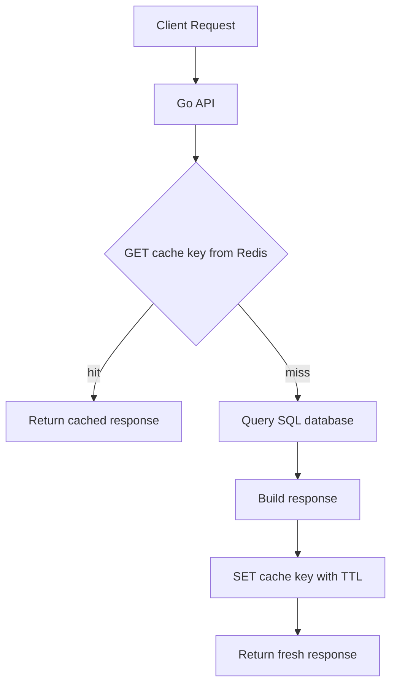

# Day 4: Caching Fundamentals

## Goal of the Day
Understand how Redis is used as a cache in backend systems, including cache-aside, read-through basics, write-through basics, invalidation, hot keys, and TTL strategy.

By the end of today, you should be able to:

- Explain what caching is and why Redis is commonly used for it.
- Describe cache hit and cache miss behavior.
- Implement the cache-aside flow conceptually.
- Understand simple cache invalidation options.
- Choose reasonable TTL values for different cached data.
- Recognize hot key problems.

## Why This Matters in Go Backend Work
Caching is one of the most common Redis use cases in Go backend services. A cache can reduce database load, lower API latency, and protect slower dependencies.

Common examples:

| Backend Scenario | Without Cache | With Redis Cache |
|---|---|---|
| User profile read | Query SQL every request | Read Redis first, SQL only on miss |
| Product details | Hit database repeatedly | Cache popular product responses |
| Feature flags | Read config storage often | Cache active flag values |
| Expensive report summary | Recalculate every request | Store computed summary temporarily |
| Third-party API result | Call external API often | Cache response for short time |

Caching improves performance, but it introduces correctness questions. You must decide how fresh the cached data needs to be.

## Core Concepts

### Cache
A cache stores a copy of data so future reads can be faster.

In a typical backend:

- SQL database is the source of truth.
- Redis stores temporary copies of selected data.
- The application decides when to read, write, expire, or delete cached data.

### Cache Hit
A cache hit means the requested data exists in Redis.

```text
GET cache:user:1 -> found
```

The API can return quickly without querying SQL.

### Cache Miss
A cache miss means the requested data is not in Redis.

```text
GET cache:user:1 -> nil
```

The API must load data from the source of truth, then usually store it in Redis for future requests.

### Cache-Aside
Cache-aside is the most common beginner-friendly caching pattern.

The application owns the cache logic:

```text
1. Try Redis
2. If found, return cached data
3. If missing, query database
4. Save result to Redis with TTL
5. Return result
```

### Read-Through Basics
In read-through caching, the cache layer is responsible for loading missing data from the source. Many application-level Redis setups do not provide this automatically. You usually implement similar behavior in your service code.

### Write-Through Basics
In write-through caching, writes update the database and cache together. This can keep cache fresher, but it makes write paths more complex.

### Cache Invalidation
Invalidation means removing or updating stale cache data.

Common approaches:

| Approach | Meaning | Example |
|---|---|---|
| TTL-based | Let cached data expire automatically | `SET cache:user:1 "..." EX 600` |
| Delete on write | Delete cache after database update | `DEL cache:user:1` |
| Update on write | Update cache after database update | `SET cache:user:1 "new" EX 600` |
| Manual clear | Admin or deployment clears selected cache | Delete keys by known names |

## Cache Request Flow Diagram



## Command Table

| Command | Purpose | Example |
|---|---|---|
| `GET` | Read cached value | `GET cache:user:1` |
| `SET ... EX` | Store cached value with TTL | `SET cache:user:1 "payload" EX 600` |
| `DEL` | Invalidate cache manually | `DEL cache:user:1` |
| `TTL` | Check remaining cache lifetime | `TTL cache:user:1` |
| `EXPIRE` | Add or change expiry | `EXPIRE cache:user:1 300` |
| `MGET` | Read multiple cache keys | `MGET cache:user:1 cache:user:2` |
| `MSET` | Set multiple values | `MSET cache:a "1" cache:b "2"` |

## CLI Practice
Open Redis CLI:

```bash
docker exec -it redis-practice redis-cli
```

Start clean:

```redis
FLUSHDB
```

Simulate a cache miss:

```redis
GET cache:user:1
```

Store a cached response:

```redis
SET cache:user:1 "{id:1,name:Alice}" EX 60
GET cache:user:1
TTL cache:user:1
```

Simulate cache invalidation after user update:

```redis
DEL cache:user:1
GET cache:user:1
```

Simulate storing updated cache:

```redis
SET cache:user:1 "{id:1,name:Alice Updated}" EX 60
GET cache:user:1
```

## Caching Patterns

### Cache-Aside Pattern
Use this when your Go service should control Redis directly.

```text
GET /users/1
```

Pseudo-flow:

```text
1. Build key: cache:user:1
2. GET cache:user:1
3. If value exists, return it
4. If value is missing, query SQL for user 1
5. Serialize response
6. SET cache:user:1 response EX 600
7. Return response
```

Benefits:

- Simple to understand.
- Works well for many APIs.
- Cache failure can often be treated as a miss.

Tradeoffs:

- First request after expiry is slower.
- Multiple simultaneous misses can hit the database together.
- You must handle invalidation carefully.

### Delete-on-Write Pattern
When source data changes, delete the related cache key.

```text
PUT /users/1
```

Pseudo-flow:

```text
1. Validate request
2. Update SQL database
3. DEL cache:user:1
4. Return success
```

The next read will rebuild the cache from SQL.

### Update-on-Write Pattern
When source data changes, update Redis immediately.

```text
1. Update SQL database
2. SET cache:user:1 updated_response EX 600
3. Return success
```

This can reduce the next read latency, but you must ensure the cached response matches the database update.

## TTL Strategy
TTL is one of the most important cache design decisions.

| Data | Example TTL | Reason |
|---|---|---|
| User profile | 5-15 minutes | Usually changes occasionally |
| Product detail | 10-60 minutes | Depends on price/stock freshness needs |
| Feature flags | 30-120 seconds | Config changes should apply quickly |
| Expensive report | 5-30 minutes | Avoid recalculating too often |
| Third-party response | 1-10 minutes | Protect external dependency but avoid stale data |

Guidelines:

- Short TTL improves freshness but increases database reads.
- Long TTL improves cache hit rate but increases stale-data risk.
- Sensitive or fast-changing data should have short TTL or no cache.
- Temporary cache keys should almost always have expiry.

## Hot Keys
A hot key is a Redis key that receives too much traffic.

Example:

```text
cache:homepage
cache:global_config
leaderboard:weekly
```

Hot keys can become a bottleneck because many clients repeatedly request the same key.

| Hot Key Cause | Risk | Possible Response |
|---|---|---|
| Very popular endpoint | Redis CPU/network pressure | Cache locally in app briefly |
| One global key | Single key gets all traffic | Split data by segment when possible |
| Long-lived popular cache | Hidden dependency on one key | Monitor and set clear TTL strategy |
| Cache miss on hot key | Many requests hit database | Use locking or request coalescing in advanced systems |

For now, focus on recognizing the problem. Advanced hot-key mitigation can come later.

## Production Notes

| Topic | Production Guidance |
|---|---|
| Source of truth | Keep SQL or primary storage authoritative |
| TTL | Always choose TTL intentionally |
| Serialization | Use a consistent response format |
| Cache misses | Treat misses as normal behavior |
| Redis failure | Design APIs to degrade gracefully when possible |
| Invalidation | Delete or update cache when source data changes |
| Observability | Track hit rate, miss rate, latency, memory, and errors |

## Common Mistakes

| Mistake | Why It Is a Problem | Better Approach |
|---|---|---|
| Caching everything | Wastes memory and increases complexity | Cache hot or expensive reads first |
| No TTL on cache keys | Stale data and memory growth | Use `SET ... EX` |
| Random key naming | Hard to invalidate correctly | Use predictable key patterns |
| Ignoring writes | Users see stale data | Delete or update cache after writes |
| Caching sensitive data carelessly | Security and privacy risk | Avoid or minimize sensitive cached payloads |
| Assuming Redis is always available | Redis outages can break API | Handle Redis errors as cache misses when safe |

## Go-Focused Scenario
Imagine a Go API endpoint:

```text
GET /users/1
```

Cache-aside pseudo-code flow:

```text
1. key = cache:user:1
2. cached = redis.GET(key)
3. if cached exists, return cached response
4. user = sql.QueryUserByID(1)
5. response = serialize user
6. redis.SET(key, response, EX 600)
7. return response
```

Update endpoint:

```text
PUT /users/1
```

Delete-on-write pseudo-code flow:

```text
1. Validate input
2. Update SQL user row
3. redis.DEL(cache:user:1)
4. Return success
```

This keeps SQL as the source of truth and lets Redis rebuild the cache on the next read.

## Practice Tasks

### Task 1: Simulate Cache-Aside Manually
Run:

```redis
GET cache:user:10
SET cache:user:10 "{id:10,name:Demo}" EX 60
GET cache:user:10
TTL cache:user:10
```

Think of the first `GET` as the cache miss and the `SET` as the API storing the database result.

### Task 2: Simulate Invalidation
Run:

```redis
GET cache:user:10
DEL cache:user:10
GET cache:user:10
```

After `DEL`, the next API request would need to query SQL again.

### Task 3: Compare TTL Choices
Create three cache keys:

```redis
SET cache:feature_flags "flags" EX 30
SET cache:user:20 "user payload" EX 600
SET cache:report:daily "report payload" EX 1800
TTL cache:feature_flags
TTL cache:user:20
TTL cache:report:daily
```

Explain why each key has a different TTL.

### Task 4: Identify Hot Key Candidates
Write down which of these may become hot keys:

| Key | Hot Key Candidate? | Reason |
|---|---|---|
| `cache:homepage` |  |  |
| `cache:user:1` |  |  |
| `cache:user:999999` |  |  |
| `cache:global_config` |  |  |
| `cache:product:popular-item` |  |  |

### Task 5: Practice Safe Cleanup
Clean only the cache keys you created:

```redis
DEL cache:user:10 cache:feature_flags cache:user:20 cache:report:daily
```

Then check:

```redis
GET cache:user:10
TTL cache:user:20
```

## End-of-Day Checklist

- [ ] I can explain cache hit and cache miss.
- [ ] I can describe cache-aside flow step by step.
- [ ] I know why SQL should usually remain the source of truth.
- [ ] I can use `SET ... EX` for cache entries.
- [ ] I understand delete-on-write cache invalidation.
- [ ] I can choose basic TTL values based on freshness needs.
- [ ] I can recognize possible hot keys.

## Cheat Sheet / Summary

| Concept | Quick Reminder |
|---|---|
| Cache | Temporary fast copy of data |
| Cache hit | Redis has the value |
| Cache miss | Redis does not have the value |
| Cache-aside | App checks Redis, queries DB on miss, then stores cache |
| Invalidation | Removing or updating stale cache |
| TTL strategy | Balance freshness, performance, and memory |
| Hot key | One key receives very high traffic |
| `SET ... EX` | Best basic command for storing cache with expiry |
| `DEL` | Simple cache invalidation command |

Day 4 is complete when you can explain how a Go API uses Redis cache-aside and how cached data becomes fresh again after updates.
